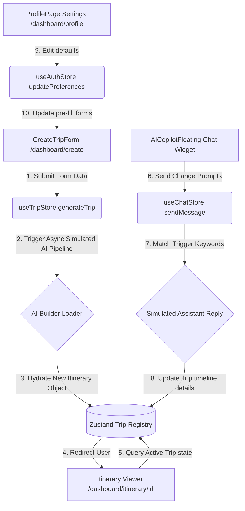

# TravelMind AI - System Documentation

Welcome to the official technical documentation for the **TravelMind AI** platform. This document serves as a comprehensive reference guide for developers, product designers, and frontend engineers looking to understand, maintain, or scale the application.

---

## 🗺️ Architectural Flow Diagram

The following diagram illustrates how user input propagates through our state engines, triggers simulated AI operations, updates the central database logs, and syncs updates directly with the interactive timeline and Chat Copilot.



---

## 🛠️ Technology Stack

| Technology | Role in Project | Version | Key Benefits |
| :--- | :--- | :--- | :--- |
| **Next.js** | Core Framework | `16.2.7` | App Router routing, Turbopack, and build prerender controls. |
| **React** | Component Library | `19.2.4` | Hook utilities, client state rendering, and Suspense support. |
| **TypeScript** | Language | `v5.x` | Strict type definitions, autocomplete safety, and interface design. |
| **Tailwind CSS** | Styling System | `v4.x` | Theme config, CSS-variables support, and utility classes. |
| **Zustand** | State Store | `v5.x` | Lightweight, fast client-side state engine bypassing context boilerplate. |
| **Framer Motion** | Animation Engine | `v11.x` | Smooth page-slides, loading steps, and hover micro-animations. |
| **React Hook Form** | Form Handler | `v7.x` | Standardized validators, form states, and input field controllers. |
| **Zod** | Schema Validator | `v3.x` | Strongly typed object validation matching form controls. |
| **Lucide Icons** | Icon Library | `v0.x` | Modern, clean vector symbols for visual clarity. |

---

## 📂 File and Directory Layout

The codebase utilizes a modular, highly scalable folder architecture:

```text
TRAVELING APP/
├── .next/                         # Compiled Next.js production builds
├── node_modules/                  # Package dependencies
├── public/                        # Static assets (images, favicon)
├── src/
│   ├── app/                       # App Router routing directories
│   │   ├── (auth)/                # Authentication grouping
│   │   │   ├── forgot-password/   # Password reset screen
│   │   │   ├── login/             # Sign in screen
│   │   │   └── register/          # Sign up screen
│   │   ├── dashboard/             # Dashboard root layout & folders
│   │   │   ├── create/            # Multi-step trip planner wizard
│   │   │   ├── itinerary/         # Dynamic day timeline viewers
│   │   │   │   └── [id]/          # Dynamic itinerary detail views
│   │   │   ├── profile/           # User preference settings & stats
│   │   │   ├── layout.tsx         # Sidebar, Copilot, & Mobile Nav layout
│   │   │   └── page.tsx           # Dashboard home overview widgets
│   │   ├── globals.css            # Stylesheets & Tailwind variables
│   │   ├── layout.tsx             # Main root layout (header settings)
│   │   └── page.tsx               # Marketing Landing Page
│   ├── components/                # Shared reusable components
│   │   ├── copilot/               # AI Chat Copilot assistant portals
│   │   │   └── AICopilotFloating.tsx
│   │   ├── navigation/            # Headers, Footers, and Nav bars
│   │   │   ├── DashboardSidebar.tsx
│   │   │   ├── Footer.tsx
│   │   │   ├── MobileNav.tsx
│   │   │   └── Navbar.tsx
│   │   └── ui/                    # Base visual elements
│   │       └── Cards.tsx          # Card systems (Feature, Destination, Budget)
│   └── store/                     # Zustand state management engines
│       ├── useAuthStore.ts        # User preferences & mock profile store
│       ├── useChatStore.ts        # AI Copilot message thread histories
│       └── useTripStore.ts        # Pre-seeded itineraries & AI generation
├── package.json                   # Project scripts and dependencies
├── tsconfig.json                  # TypeScript compiler settings
├── start.bat                      # Windows double-click startup shortcut
└── tailwind.config.ts             # Tailwind configurations
```

---

## 🎨 Styling and Theme System

Styling is configured inside [globals.css](file:///c:/Users/saira/OneDrive/Desktop/TRAVELING%20APP/src/app/globals.css) using CSS-variables linked directly to Tailwind's `@theme` directive.

### Color Palettes
- **Primary Color**: `#2563EB` (Blue 600) | Dark Mode: `#3B82F6` (Blue 500)
- **Accent Color**: `#06B6D4` (Cyan 500) | Dark Mode: `#22D3EE` (Cyan 400)
- **Secondary Color**: `#8B5CF6` (Purple 500) | Dark Mode: `#A78BFA` (Purple 400)
- **Backgrounds**: Light: `#F8FAFC` (Slate 50) | Dark: `#030712` (Gray 950)
- **Card Fills**: Light: `#FFFFFF` | Dark: `#0B0F19` (Gray 900 custom)

### Glassmorphism Presets
Custom glass effect rules are applied to panels, cards, and navigation overlays:
```css
/* Light Glassmorphism */
.glass {
  background: rgba(255, 255, 255, 0.45);
  backdrop-filter: blur(12px);
  border: 1px solid rgba(255, 255, 255, 0.25);
}

/* Dark Glassmorphism */
.dark .glass {
  background: rgba(11, 15, 25, 0.45);
  backdrop-filter: blur(12px);
  border: 1px solid rgba(255, 255, 255, 0.05);
}
```

---

## 🗃️ State Management Stores (Zustand)

### 1. `useAuthStore`
Tracks the current mock logged-in user profile, travel statistics, and theme toggling.
- **State Properties**:
  - `user`: User data object (Name, email, avatar, default preferences).
  - `isAuthenticated`: Boolean checks.
  - `theme`: `"light" | "dark"`.
- **Actions**:
  - `login(email, name)`: Simulates login and sets default credentials.
  - `register(email, name)`: Creates a new user entry.
  - `toggleTheme()`: Swaps light/dark presets and applies `.dark` classes to the document element.
  - `updatePreferences(prefs)`: Overwrites interest tags and travel styles.

### 2. `useTripStore`
Manages saved trips, active itinerary details, and compiles new travel timelines.
- **State Properties**:
  - `trips`: Array registry of all created itineraries (preseeded with Tokyo & Paris).
  - `activeTrip`: Trip object currently in focus.
  - `isGenerating`: Indicates active AI background processing.
  - `generationStep`: Numeric value tracking progress bar percentages (0 to 100).
  - `generationStatus`: String updates (e.g., "Structuring final timeline...").
- **Actions**:
  - `setActiveTrip(id)`: Changes the viewer target itinerary.
  - `deleteTrip(id)`: Removes a trip log.
  - `generateTrip(params)`: Triggers sequential intervals simulating web crawling, map routing, weather forecasts, and dining pins.

### 3. `useChatStore`
Handles the Travel Copilot message logs and simulates context-driven responses.
- **State Properties**:
  - `messages`: Thread array of dialogue bubbles.
  - `isOpen`: Chat container collapsible state.
  - `isTyping`: Renders active jumping dots.
- **Actions**:
  - `sendMessage(text)`: Adds user text and schedules automated keyword response tasks (e.g., matching "cheaper" to reduce lodging prices).

---

## 🖥️ Page Specifications

### 1. Landing Page (`/`)
An interactive marketing page.
- **Hero Banner**: Animated with Framer Motion; features a dynamic subtitle, a "Start Planning" primary CTA, and a "Watch Demo" overlay modal.
- **Features Section**: Incorporates 3D-hover `FeatureCard` structures highlighting map routing, weather bails, and budget constraints.
- **Timeline Stepper**: A step-by-step visualizer outlining the creation sequence.
- **Pricing Plans**: Side-by-side matrices outlining Free (Explorer) vs. $12/mo (Globetrotter) options.

### 2. Authentication Portal (`/login`, `/register`, `/forgot-password`)
Minimal, card-based entry pages utilizing schema validators.
- **React Hook Form**: Enforces client-side validation rules (e.g., password length, valid email structure).
- **Social Login Mockup**: Google OAuth button redirects user to the dashboard after a short delay.
- **Reset State transitions**: Transition states display confirmation messages upon form submission.

### 3. User Dashboard Overview (`/dashboard`)
Serves as the main control center for users.
- **Metrics Bar**: Displays cards tracking Total Trips, Upcoming Trips, Saved Locations, and AI Recommendation scores.
- **Itinerary Registry**: Feeds created/saved travel cards; handles details linking and trip deletion triggers.
- **AI Recommendation panel**: Curated destination chips that launch pre-filled wizards upon clicking.

### 4. Create Trip Wizard (`/dashboard/create`)
A multi-step questionnaire wrapped inside a React Suspense container to ensure clean static page generation.
- **Wizard Steps**:
  1. *Destination*: Autocomplete input (requires at least 2 characters).
  2. *Travel Dates*: Start/End date selectors.
  3. *Budget*: Selectors for Budget, Mid-range, and Luxury tiers.
  4. *Travel Style*: Selection grid including Adventure, Luxury, Family, Solo, and Backpacking.
  5. *Interests*: Chip-select lists (Beaches, Food, History, Photography, Trekking).
- **AI Generation Screen**: Overlays a glass panel with progress bars showing active compiling stages.

### 5. Itinerary Details Viewer (`/dashboard/itinerary/[id]`)
Synthesizes generated itineraries into a comprehensive review layout.
- **Timeline tabs**: Switches views day by day.
- **Daily Schedule**: Displays vertical timecards detailing morning, afternoon, evening, and night activities.
- **Widgets Panel**:
  - *Weather forecast*: Displays local temperatures and conditions.
  - *Cost Breakdown*: Visualizes accommodation, dining, activities, and transit costs via `BudgetCard` charts.
  - *Suggestions*: Interactive cards highlighting hotel pins, dining, and transit options.

---

## ⚡ Execution Commands

To execute the project in your local workspace:

### 1. Run Development Server
```bash
npm run dev
```

### 2. Run Production Build
```bash
npm run build
```

### 3. Run Shortcut Batch Script
Double-click `start.bat` in the workspace root. It will open `http://localhost:3000` in your default browser and launch the Next.js development server automatically.
