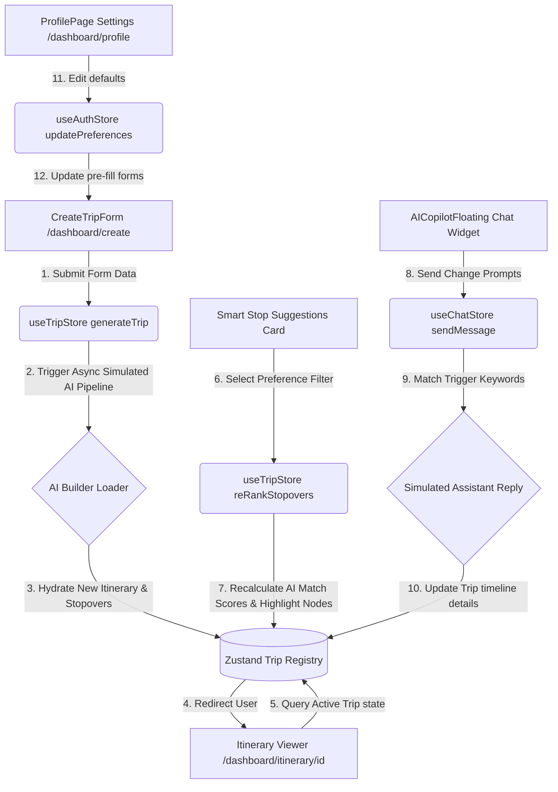

# TravelMind AI (India Edition) - System Documentation

Welcome to the official technical documentation for the **TravelMind AI (India Edition)** platform. This document serves as a comprehensive reference guide for developers, product designers, and frontend engineers looking to understand, maintain, or scale the application.

## 🌟 Primary Product Message
> "India's First AI Travel Platform That Discovers The Journey, Not Just The Destination."

---

## 🗺️ Architectural Flow Diagram

The following diagram illustrates how user input propagates through our state engines, triggers simulated AI operations, updates the central database logs, and syncs updates directly with the interactive timeline and Chat Copilot.



---

## 🛠️ Technology Stack

| Technology | Role in Project | Version | Key Benefits |
| :--- | :--- | :--- | :--- |
| **Next.js** | Core Framework | `16.2.7` | App Router routing, Turbopack, and build prerender controls. |
| **React** | Component Library | `19.2.4` | Hook utilities, client state rendering, and Suspense support. |
| **TypeScript** | Language | `v5.x` | Strict type definitions, autocomplete safety, and interface design. |
| **Tailwind CSS** | Styling System | `v4.x` | Theme config, CSS-variables support, and utility classes. |
| **Zustand** | State Store | `v5.x` | Lightweight, fast client-side state engine bypassing context boilerplate. |
| **Framer Motion** | Animation Engine | `v11.x` | Smooth page-slides, loading steps, and hover micro-animations. |
| **React Hook Form** | Form Handler | `v7.x` | Standardized validators, form states, and input field controllers. |
| **Zod** | Schema Validator | `v3.x` | Strongly typed object validation matching form controls. |
| **Lucide Icons** | Icon Library | `v0.x` | Modern, clean vector symbols for visual clarity. |

---

## 📂 File and Directory Layout

The codebase utilizes a modular, highly scalable folder architecture:

```text
TRAVELING APP/
├── src/
│   ├── app/                       # App Router routing directories
│   │   ├── (auth)/                # Authentication grouping
│   │   │   ├── forgot-password/   # Password reset screen
│   │   │   ├── login/             # Sign in screen
│   │   │   └── register/          # Sign up screen
│   │   ├── dashboard/             # Dashboard root layout & folders
│   │   │   ├── create/            # Multi-step trip planner wizard (India-tailored)
│   │   │   ├── itinerary/         # Dynamic day timeline viewers
│   │   │   │   └── [id]/          # Route mapping & flagship journey views
│   │   │   ├── profile/           # User preference settings & stats
│   │   │   ├── layout.tsx         # Sidebar, Copilot, & Mobile Nav layout
│   │   │   └── page.tsx           # Dashboard home overview widgets
│   │   ├── globals.css            # Stylesheets & Tailwind variables
│   │   ├── layout.tsx             # Main root layout (header settings)
│   │   └── page.tsx               # Marketing Landing Page
│   ├── components/                # Shared reusable components
│   │   ├── copilot/               # AI Chat Copilot assistant portals
│   │   │   └── AICopilotFloating.tsx
│   │   ├── navigation/            # Headers, Footers, and Nav bars
│   │   │   ├── DashboardSidebar.tsx
│   │   │   ├── Footer.tsx
│   │   │   ├── MobileNav.tsx
│   │   │   └── Navbar.tsx
│   │   └── ui/                    # Base visual elements
│   │       ├── Cards.tsx          # Card systems (Feature, Destination, Budget)
│   │       ├── India3DMap.tsx     # 3D tilted map canvas (glowing route & particle trails)
│   │       └── JourneyTimeline.tsx # Vertical attraction step-by-step route timeline
│   └── store/                     # Zustand state management engines
│       ├── useAuthStore.ts        # User preferences & mock profile store
│       ├── useChatStore.ts        # AI Copilot message thread histories
│       └── useTripStore.ts        # Pre-seeded itineraries & India roadtrip database
├── package.json                   # Project scripts and dependencies
├── start.bat                      # Windows double-click startup shortcut
└── tailwind.config.ts             # Tailwind configurations
```

---

## 🎨 Styling and Theme System

Styling is configured inside [globals.css](file:///c:/Users/saira/OneDrive/Desktop/TRAVELING%20APP/src/app/globals.css) using CSS-variables linked directly to Tailwind's `@theme` directive.

### Color Palettes
- **Primary Color**: `#2563EB` (Blue 600) | Dark Mode: `#3B82F6` (Blue 500)
- **Accent Color**: `#06B6D4` (Cyan 500) | Dark Mode: `#22D3EE` (Cyan 400)
- **Secondary Color**: `#8B5CF6` (Purple 500) | Dark Mode: `#A78BFA` (Purple 400)
- **Backgrounds**: Light: `#F8FAFC` (Slate 50) | Dark: `#030712` (Gray 950)
- **Card Fills**: Light: `#FFFFFF` | Dark: `#0B0F19` (Gray 900 custom)

### Glassmorphism Presets
Custom glass effect rules are applied to panels, cards, and navigation overlays:
```css
/* Light Glassmorphism */
.glass {
  background: rgba(255, 255, 255, 0.45);
  backdrop-filter: blur(12px);
  border: 1px solid rgba(255, 255, 255, 0.25);
}

/* Dark Glassmorphism */
.dark .glass {
  background: rgba(11, 15, 25, 0.45);
  backdrop-filter: blur(12px);
  border: 1px solid rgba(255, 255, 255, 0.05);
}
```

---

## 🗃️ State Management Stores (Zustand)

### 1. `useAuthStore`
Tracks the current mock logged-in user profile, travel statistics, and theme toggling.
- **State Properties**:
  - `user`: User data object (Name, email, avatar, default preferences).
  - `isAuthenticated`: Boolean checks.
  - `theme`: `"light" | "dark"`.

### 2. `useTripStore` (Journey Discovery Engine™ Upgrades)
Manages saved trips, active itinerary details, and compiles new travel timelines along routes.
- **State Properties**:
  - `trips`: Array registry of all created itineraries (preseeded with Tokyo, Paris, and the **Bhimavaram to Hyderabad Bike Roadtrip**).
  - `activeTrip`: Trip object currently in focus.
  - `isGenerating`: Indicates active AI background processing.
- **Stopover Attributes**:
  - `name`: Spot name.
  - `category`: Spiritual, Food, Heritage, Nature, Viewpoint, Adventure, or Instagram.
  - `description`: Travel spot metadata.
  - `distanceFromRoute`: in km off the main highway line.
  - `recommendedVisitTime`: Suggested visit duration.
  - `aiScore`: Calculated matching scores dynamically prioritized by preferences.
- **Actions**:
  - `generateTrip(params)`: Compiles the source city, transport mode (Bike, Car, Train, Flight), regional language, and route stopover lists.
  - `reRankStopovers(tripId, preference)`: Recalculates attraction match percentages on filters change and pulses the relevant nodes on the 3D map canvas.

### 3. `useChatStore`
Handles the Travel Copilot message logs and simulates context-driven responses.

---

## 🖥️ Page Specifications

### 1. Landing Page (`/`)
An interactive marketing page with hero sections, feature grids, pricing, and the **POTHU RAJU** signature footer.

### 2. Authentication Portal (`/login`, `/register`, `/forgot-password`)
Minimal, card-based entry pages utilizing schema validators.

### 3. User Dashboard Overview (`/dashboard`)
Serves as the main control center for users.

### 4. Create Trip Wizard (`/dashboard/create`)
A multi-step questionnaire wrapped inside a React Suspense container.
- **Wizard Steps**:
  1. *Route*: Collects Starting City (Source) and Destination City.
  2. *Intelligence & Mode*: Collects regional language switcher (Hindi, Telugu, English, etc.) and transport mode.
  3. *Dates & Budget*: Start/End date selectors and budget tier.
  4. *Smart Preferences*: AI stop highlights priority (Temples 🛕, Food 🍛, Nature 🌿, Adventure 🏍️, History 🏰, Photography 📸).
  5. *Interests*: Chip lists including Spiritual Tourism, Food Discovery, and Heritage Routes.

### 5. Itinerary Details Viewer (`/dashboard/itinerary/[id]`)
Synthesizes generated itineraries into a comprehensive review layout.
- **Journey Between Destinations (Flagship Section)**:
  - **India3DMap**: Interactive canvas map displaying an isometric 3D-like layout of India with glowing particle trails along the route path, and pulsing dots.
  - **AI Smart Stop Suggestions**: Card selector allowing travelers to re-rank the highway attractions list.
  - **JourneyTimeline**: A vertical timeline mapping out all stops, Unsplash photography, off-route distances, suggested stay durations, and match scores.
- **Day-by-Day Timeline**: Standard daily schedules (Morning, Afternoon, Evening, Night).
- **Widgets Panel**: Weather forecast, `BudgetCard` cost charts, hotel listings, dining spots, and transit suggestions.

---

## ⚡ Execution Commands

To execute the project in your local workspace:

### 1. Run Development Server
```bash
npm run dev
```

### 2. Run Production Build
```bash
npm run build
```

### 3. Run Shortcut Batch Script
Double-click `start.bat` in the workspace root. It will open `http://localhost:3000` in your default browser and launch the Next.js development server automatically.
